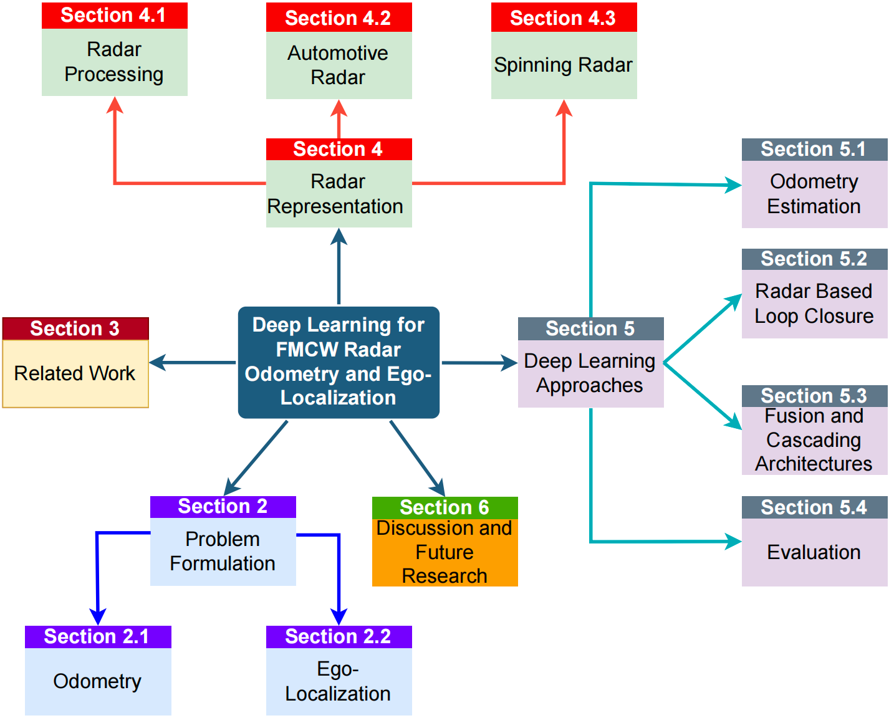
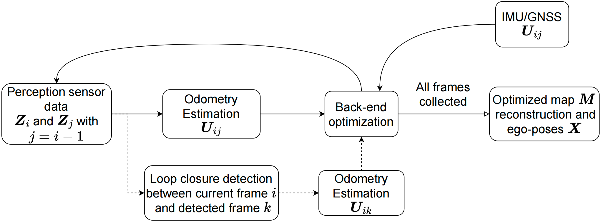
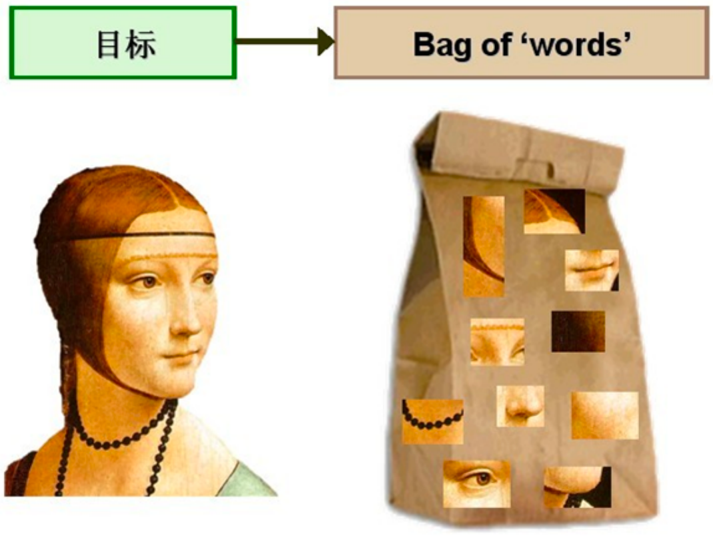

# 深度学习在 FMCW 雷达里程计和自定位中的应用方法综述

于 Appl. Sci. 2024 发表



## 公式化问题

SLAM 目标：在 1～t 时间内，使用感知数据 $Z_{1:t} = \{Z_1,\ldots,Z_t\}$ 、收集的里程计数据 $U_{1:t} = \{U_1,\ldots,U_t\}$ 、初始起点 $X_0$ 的观测，来优化全局地图 $M$ 中记录的自定位位姿 $X_{1:t} = \{X_1,\ldots,X_t\}$ 和 n 个地标位置 $M = m_{1:n} = \{m_1,\ldots,m_n\}$ ,数学上概率公式被定义为：

$$P(X_{1:t},M \mid Z_{1:t},U_{1:t},X_0)$$

自身位置和里程计测量，使用特殊欧几里得群变换矩阵 $T \in SE(2)$ 或 $T \in SE(3)$，其中 $t$ 是平移向量，$R$ 是旋转矩阵 $$T = \begin{bmatrix}R & t \\0 & 1\end{bmatrix}$$

任何 SLAM 方法的最终目标都是确定轨迹 $X_{1:t}$ 和地标地图 $M$ 的最大后验概率：$$\{X^*, M^*\}=\underset{\{X, M\}}{\arg\max}\; P(X_{1:t}, M \mid Z_{1:t}, U_{1:t},X_0)$$

为求解公式3，一般假设静态全局地图并利用马尔可夫性质，从而将 SLAM 问题概率化为一个动态贝叶斯网络（DBN），在模型内，$X_0、Z_{1:t}、U_{1:t}$ 都是可观测变量，模型隐藏变量有 $X_{1:t}$ （序列位姿）和地图 M 。而新位姿取决于先前位姿和当前里程计测量，其状态转移模型：$P(X_t \mid X_{t-1},U_t)$ ，再一个是观测模型：$P(Z_t \mid X-t,M)$，表示知道当前位置和真实地图，那么传感器应该“看”到什么。状态转移模型能预测，但会漂移，所以用观测模型校正，但其又不能单独估计运动

DBN 也可以使用图来绘制，节点对应位姿 $X_t$，边作为约束连接两个位姿。这些约束可以基于位姿之间的里程计测量 $U_t$ 建立（我认为我从 $X_t$ 到 $X_{t+1}$ 移动了多少），或通过在不同位姿处获取的两个不同观测 $Z_t$ 的对齐来建立（我在两个时刻看到了同一个地方），其目的是纠正仅使用里程计边可能产生的任何潜在误差累积或漂移（寻找一组最一致的位姿，使所有边的约束都尽量成立）

<details>
<summary>图优化示例</summary>
比如走一个正方形：

1、从 (0, 0) 出发

2、向 右 10 米 → (10, 0)

3、向 上 10 米 → (10, 10)

4、向 左 10 米 → (0, 10)

5、向 下 10 米 → 回到 (0, 0)

但里程计测量有误差，导致：
第 1 步（向右 10m）：测成右走10.1, 下走-0.2

第 2 步（向上 10m）：测成右走0.3, 上走10.2

第 3 步（向左 10m）：测成左走-9.6

第 4 步（向下 10m）：测成下走-9.7

于是每一步的估计轨迹变成：
X₀ = (0, 0)

X₁ = X₀ + (10.1, -0.2) = (10.1, -0.2)

X₂ = X₁ + (0.3, 10.2) = (10.4, 10.0)

X₃ = X₂ + (-9.6, 0.0) = (0.8, 10.0)

X₄ = X₃ + (0.0, -9.7) = (0.8, 0.3)

最终会有(0.8, 0.3)偏差，在图优化视角下，现在拥有四条里程计边：X₀→X₁, X₁→X₂, X₂→X₃, X₃→X₄，但在观测 X₄ 时会发现，周围场景和 X₀ 差不多，于是再加一条观测边 X₄↔X₀

图优化现在需要在不违背“每一步里程计差不多正确” 的前提下，尽量让 X₄ 和 X₀ 靠近，优化器就会把误差均匀低分给每一步，即：每一步都做 0.1m、0.4m 等量级的调整，让整体轨迹更一致
</details>



## 里程计

可用 IMU（惯性测量单元）等设备提供里程计测量，一般通过卡尔曼滤波方法进行融合。亦可用基于扫描的里程计方法：通过分析雷达/激光雷达/视觉传感器所捕获的环境数据来推算自运动，但也会引入自身带来的挑战。任何惯性传感器都需要定期[校准](https://www.mdpi.com/2072-666X/13/6/879)

在扫描匹配领域，一种常见的方法是基于距离的特征匹配，雷达图像通常用点云或二维鸟瞰图像表示，目标是让连续的扫描对齐，来估计最可能的变换（深度学习已经可以替代），传统方法有：用于视觉数据的定向 FAST 和旋转 BRIEF[（ORB）特征](https://ieeexplore.ieee.org/abstract/document/6126544) 以及尺度不变特征变换[（SIFT）特征](https://link.springer.com/article/10.1023/B:VISI.0000029664.99615.94)，以及为雷达数据量身定制的保守滤波以高效精确雷达里程计[（CFEAR）特征](https://ieeexplore.ieee.org/abstract/document/9636253)

## 自定位

无论什么样的里程计估计，随着时间推移都存在漂移，于是采用自定位的方式进行回环检测，来识别之前访问过的位置，当发现访问过的位置时，在当前扫描和过往扫描之间执行扫描匹配程序，确定变换矩阵，根据匹配结果调整姿态。为了将新扫描与存储的扫描集中进行匹配，以判断是否将边添加到图优化中，一种常见的方法是[词袋模型（BoW）](https://arxiv.org/pdf/2208.07473)，BoW 技术将每个扫描视为视觉词的集合，简洁地表示为单个向量。这些视觉词包含通过 SIFT、SURF、ORB 或训练网络提取的特征



## FMCW 雷达

常规处理、常规不足、常规结果，为了提高物体的可见性与检测能力，一般会安装多个传感器来实现360度视野，由于空间和时间上的差异，结合这些多个传感器的特征需要进行进一步处理，最终形成统一的表示

## 旋转 FMCW 雷达

用单个/少量发射和接收天线的 FMCW 雷达，通常安装在车顶并围绕其垂直轴旋转，利用发射和接收波之间的频率偏移来计算物体的距离，返回信号提供有关物体反射率、大小、形状以及相对于接收器的方向的信息，但到达方向由旋转雷达的当前角度决定，从而产生极化功率谱。[引用1](https://ieeexplore.ieee.org/abstract/document/1389389)、[引用2](https://ieeexplore.ieee.org/abstract/document/5438923)。旋转雷达就是把一个普通 FMCW 雷达物理旋转起来，使其能产生 360° 高稠密扫描，成为类似激光雷达的 2D 雷达

这种二维极谱（极坐标格式的距离-角度图）不需要多天线阵列即可获得方向信息（DOA），生成的点云比 FMCW 雷达更稠密。由于缺乏天线，旋转雷达设置无法确定任何高度信息，通常用于二维场景

|      参数          | Spinning Radar  |   Radar    |
| --------------| --------------| ------------------|
| DOA 获取方式        | 通过机械旋转角度获得      | 通过 MIMO 天线阵列 FFT 获得 |
| 输出格式            | 极坐标 2D 图（dense） | 3D/4D 点云（sparse）    |
| 是否包含 Doppler    | 公开数据一般没有    | 通常有                 |
| 是否包含 RCS        | 公开数据一般没有        | 有                   |
| 噪声              | 相对较低（更密集）       | 较高、鬼影多              |
| 高度（elevation）信息 | 没有          | 新型雷达可有              |
| 适用 SLAM 场景      | 2D 场景非常适合   | 更适合 3D 场景           |

其数据稠密、无需拼接多个雷达数据、类似 2D 激光雷达，继承了大量 Lidar SLAM 方法（ICP、NDT、Polar scan matching、ScanContext、基于 Fourier 的旋转估计）

但局限也很明显：

1. 缺少天线阵列，无法获得高度信息，因此仅能用于 2D 场景

2. **数据集**中常无 Doppler（速度信息）与 RCS（散射截面），很难区分静止/动态物体，很难做速度滤波

3. 扫描频率低，旋转频率只有 4Hz ，对快速运动场景不友好

第 2 和第 3 点局限是基于已有数据集列出的。本文叙述的是引入深度学习在雷达里程计中

## 深度学习领域的里程计估计

一个挑战在于识别相关特征并在连续帧中有效跟踪它们，如果这些相关特征能够被成功识别并持续跟踪，则可以使用可微分的点匹配机制（如[Kabsch算法](https://journals.iucr.org/paper?buy=yes&cnor=a12999&showscheme=yes&sing=yes)）来确定帧之间的变换矩阵 $T \in SE(3)$ 。所以问题的核心仍然在于识别这些特征并建立准确的点关联

模型从点云和图像中提取关键点的能力在 [VSLAM](https://ieeexplore.ieee.org/abstract/document/10054007) 和[基于激光雷达的 SLAM 方法](https://ieeexplore.ieee.org/abstract/document/10123407)中深入探究。$\alpha是超参数，\hat{t}、\hat{R}是预测的平移向量与旋转矩阵，\mathbf{I}是单位阵$，常用的损失函数：

$$\mathcal{L}=\lVert \hat{t} t \rVert_2-\alpha \, \lVert \hat{R} R^{T} -\mathbf{I} \rVert_2$$

## 雷达里程计估计

稠密图像的旋转雷达：[Masking By Moving](https://arxiv.org/abs/1909.03752)、[Fast-MbyM](https://ieeexplore.ieee.org/abstract/document/9812063/)、[Under the Radar](https://ieeexplore.ieee.org/abstract/document/9196835)、[HERO](https://arxiv.org/abs/2105.14152)

- Masking by Moving：**让网络忽略无用数据**。输入两帧雷达的笛卡尔图像，网络层是一个 U-Net，输出一个同尺寸的mask，值越大越可信。将 U-Net 训练成自动屏蔽掉对 odometry 没帮助的区域，只保留稳定静态特征，本方法使用传统的扫描匹配（FFT cross correlation）去掉动态点

- Fast-MbyM 将旋转估计和平移估计分离，用 polar scan correlation 快速估计旋转，将旋转后的图重新投影，再用 correlation 找平移，降低搜索空间
    
- Under The Radar(关键点 + 描述符 + 权重)：**从雷达图像中学习关键点、描述符**。输入稠密 2D radar 反射图像（笛卡尔），网络层是 U-Net encoder-decoder 带三个输出头，这是第一个把 深度特征 + 几何求解（SVD）结合的雷达 odometry
    - keypoint heatmap（在哪里是关键点？）
    - keypoint weight（这个点是否可信？）
    - keypoint descriptor（描述符向量）
    
- HERO：扩展版 UTR，使用 EM 优化 + 不确定性建模。使用 EM 动态调整关键点权重

基于点云的雷达：[RaFlow](https://ieeexplore.ieee.org/abstract/document/9810356/)、[4DRO-Net](https://ieeexplore.ieee.org/abstract/document/10237296)、[Milli-RIO](https://ieeexplore.ieee.org/abstract/document/9193901/)

- RaFlow：使用 Scene Flow 来估计位姿。第一个成功使用 4D radar 做 scene flow 推断的 odometry 方法
    - 使用 PointNet++ 提取点特征
    - 构建 Cost Volume（scene flow 常用技术）
    - 输出每个点的 scene flow
    - 使用静态 mask 过滤动态目标
    - 对静态点使用 Kabsch 算法求得 rigid SE(3) pose

- 4DRO-Net：多尺度点特征 + Cost Volume + Pose Regression，比 RaFlow 快，结构如下：
    - Multi-scale PointNet encoder
    - Initial pose regression
    - Velocity-aware cost volume
    - Coarse-to-fine pose correction

- Milli-RIO：雷达 + LSTM Motion Model（Unscented Kalman Filter UKF 后端）。不是纯深度学习，使用了过滤器做后端，流程如下：
        LSTM 学习运动模型 f(x)
        UKF 做真正的位姿更新
        Radar NDT 匹配作为观测

深度学习不会取代 scan matching，而是提供：关键点、掩膜、权重、特征，辅助几何方法求位姿，Deep learning 最主要贡献是处理噪声与不稳定点，因为

1. $SE(2)/SE(3)$ 的结构不是欧式空间，深度网络难以学习

2. 雷达数据噪声极大，直接回归非常不稳定

3. 训练数据本身就有噪声，缺乏真值，难以训练

4. 深度学习难以建模“刚体运动约束”

5. 回归方法会累积 drift，而几何方法会自我纠错
```
Radar Scan → Deep Network → keypoint/mask/descriptor
                                  ↓
                            Geometric Solver (SVD/Correlation/Kabsch)
                                  ↓
                            Odometry T ∈ SE(2/3)
```
## 回环检测

当前扫描场景如果在历史扫描中找到相似场景，SLAM 就加入回环边，图优化修正累计漂移，定位系统重新定位

旋转雷达的输出是稠密极坐标图像，非常适合 CNN，且旋转雷达的图像更一致，因此回环检测方法更成熟、效果最强，CNN + embedding + nearest-neighbor 搜索是主流

- ScanContext Radar：原用于激光雷达，这里移植到雷达，核心思想：
    - 将雷达扫描转成一个围绕角度的柱状图（ring histogram）
    - 使用旋转不变性
    - 通过距离度量查找相似的扫描

- Radar LocNet：使用 CNN 生成场景的 embedding，流程：
    - 输入：极坐标雷达图像
    - 通过 CNN（如 ResNet）提取 global descriptor
    - 使用相似度搜索（KD-tree / nearest neighbor）找回环

    损失函数通常为：Triplet Loss、Contrastive Loss

    目标：让相似场景 embedding 靠近，不同场景分离

- HERO / Kidnapped Radar：HERO 的回环部分利用特征不确定性、可微匹配模块、多帧 aggregation；Kidnapped Radar 专注于在严重漂移后重新找到世界位置

- Look Around You / Off-the-Radar等，这些方法专注于雷达图像的全局描述、使用 transformer / attention 架构、强化对外观变化的鲁棒性

不旋转雷达的输出点云稀疏，常用PointNet、Graph Neural Network、Voxel-based CNN，而 4D 雷达回环仍然是开放挑战，难点：
1. 看起来像噪声 → 匹配困难
2. 动态物体多 → 描述难
3. 数据稀疏 → 需要强特征学习

## 全局定位

一张地图 + 当前雷达扫描 = 当前在地图上什么位置，目前定位上依然存在困难：
1. 噪声极大（ghost、多径）
2. 地图可能是激光雷达构建，而当前观测是雷达 → 传感器域差异大
3. 环境变化（天气、交通状况）导致匹配困难
4. 雷达数据缺乏纹理和结构，难以与地图直接配准

已有的解决方案：

Scan-to-Map Matching（雷达扫描 → 地图）：给定当前雷达扫描 $Z_t$，在地图 $M$ 中找到最可能的位姿 $X_t$

- Deep Radar Localization（激光地图 + 雷达扫描 → CNN 学特征），关键思路：
    - 将地图渲染成 BEV 图像
    - 将雷达 scan 转换成 BEV 图像
    - 用 Siamese 网络比较两者相似度
    - 寻找最接近的位置

- Radar Localizer（polar → cartesian → matching）:统一到笛卡尔坐标下进行匹配

- Transformers in Radar-Lidar Localization：用 Transformer 的优势处理大范围对齐、抵抗局部噪声

Embedding-based Localization（深度学习 embedding 用于全局定位）：本用于回环检测找相似的时间点，那么同理用于定位找地图上的位姿，代表性方法：NetVLAD、ResNet encoder、Polar → Cartesian 多模态融合、Triplet loss / InfoNCE loss

Pose Regression-based Localization（深度学习直接输出位姿），此方法相关文章指出，只是初级尝试阶段，效果有限，而本文认为深度学习回归位姿不适合作为强鲁棒 localization 方法

## 小结

深度学习在 SLAM ，可负责：

1. 特征提取：从稀疏、有噪声、雷达物理特性的 scan 中找稳定特征
2. 雷达 → 地图的域适应 domain adaptation：统一两种传感器的“外观”
3. 置信度估计：哪些雷达部分是可靠的
4. 多模态融合：Radar + Lidar、Radar + Camera

而位姿的输出还是需要通过scan matching（几何）、coarse + fine search（embedding）、Bayes Filter / Factor Graph 的方式

本文还强调，旋转雷达（极坐标形式）在定位上优于雷达，因其稠密、扫描一致性高、对 CNN 友好、与 Lidar map 的外观差异较小特点而使用

## 总结

FMCW 雷达具有天然噪声：

1. 多径（Multipath）：雷达波反射到玻璃、金属墙，再反射回来 → 产生 ghost 点

2. 稀疏性（Sparse）：尤其是车载毫米波，只有几十到几百个点

3. 动态物体干扰：车流、人流都会产生大量错误反射

4. 雷达信号高度依赖材质：金属反射强，水泥弱，很不均匀

深度学习模型鲁棒性不足：

1. 泛化差。在不同城市、不同天气、不同雷达型号、不同雷达安装位置模型很难泛化

2. 对环境变化极敏感。雷达虽然不受光照影响，但受雨雪、湿度、反射材质变化（如新装金属围栏）、动态物体多寡、影响非常大

数据集少，目前公开的数据集：
| 数据集                   | 问题                          |
| --------------------- | --------------------------- |
| Oxford Radar RobotCar | 没有 Doppler、无 RCS，无高程，没有真实点云 |
| MulRan                | 场景单一                        |
| Boreas                | 更好，但体量仍不足                   |
| Automotive radar 数据集  | 噪声过大，标注少                    |

需要更多跨平台、跨气候、跨国家的数据集，特别是包含 Doppler 的雷达数据

## 未来

使用 Transformer 增强全局特征提取，相较 CNN，Transformer 有：
- 更强的长距离依赖建模
- 更鲁棒的 pattern 抽象能力
- 更适合噪声环境

Radars 与其他传感器融合（Radar-Lidar / Radar-Camera）原因：
- 雷达抗天气，但细节差
- 激光雷达细节丰富，但受雨雾影响
- 摄像头提供语义，但受光照影响

多模态融合可以：
- 缓解单传感器弱点
- 提高定位鲁棒性

Radar-to-Map Learning（解决传感器域差异）：自动驾驶地图通常是 Lidar 制作的，而车上用雷达定位，这属于跨域问题，目标是：学习 Radar → Lidar / Map 的外观映射，让两者可直接匹配。技术方向：
- Domain Adaptation
- Style Transfer
- GAN
- Contrastive Learning

使用 Doppler Velocity（速度信息）提升精度，FMCW 雷达独有的 Doppler 信息：
- 能直接测相对速度
- 可用于抑制动态物体
- 可增强运动模型（减少漂移）

完全端到端的 SLAM 系统（较远目标），但 Radar SLAM 离真正的 end-to-end 还有很长距离，但未来可能出现：
- Differentiable scan matching
- Differentiable graph optimization
- Neural fields representing maps
- End-to-end pose + map learning

作者认为普通雷达的研究依然是热点，因为其各种缺点需要克服

旋转雷达数据最适合深度学习（极坐标、稠密）

深度学习的作用：提特征、提掩膜、过滤噪声、跨域匹配，位姿必须由几何解算器求解（SVD、ICP、Kabsch、Correlation）