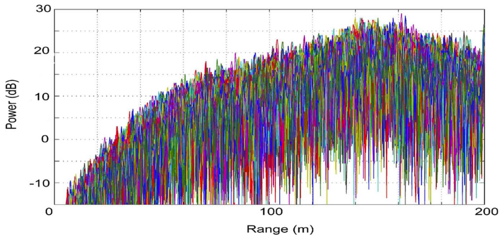
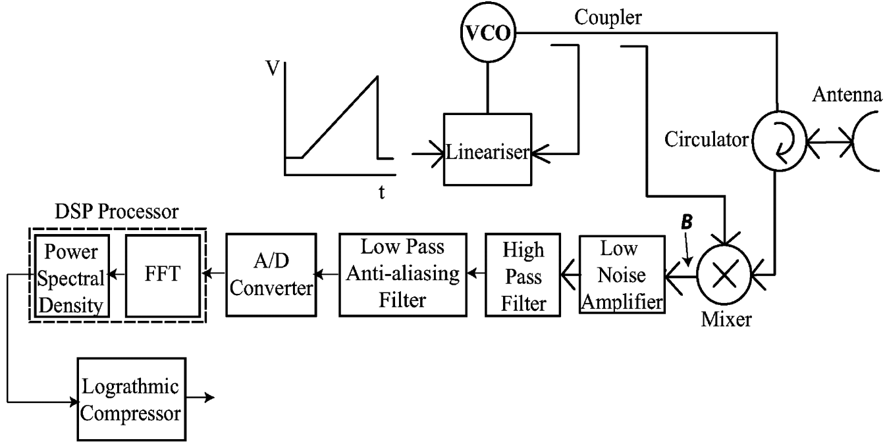
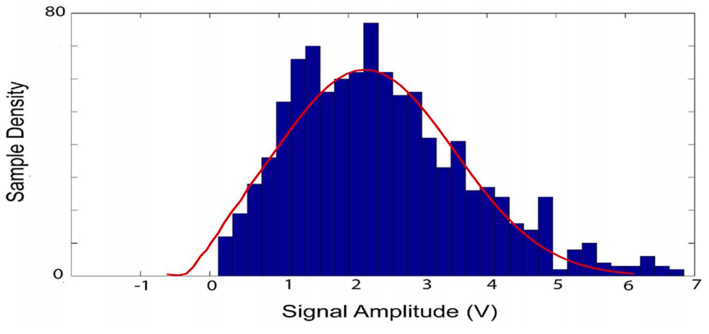
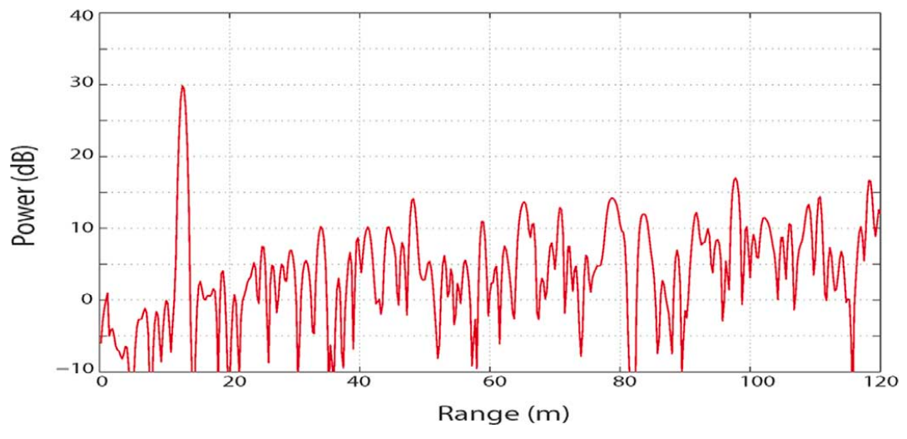
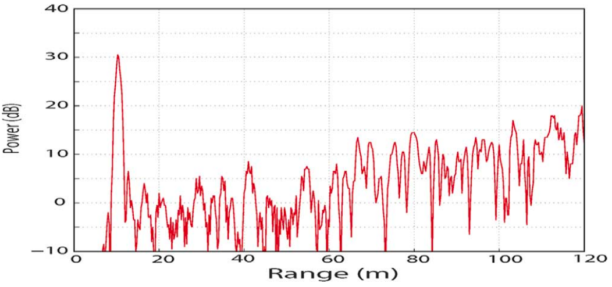

# 用于自主导航的毫米波雷达频谱预测

于 IEEE 2010. 发表

## 📑 目录
- [目标与原因](#目标与原因)
- [光谱的产生](#光谱的产生)
  
---

## 目标与原因

目标：让机器人提前预测毫米波雷达会看到什么样的回波光谱（power-range spectrum），此后简称光谱，展示图是在雷达摆动板轴承角度恒定时，叠加的测距谱，此时无目标存在

原因：

- 在 SLAM 中会预测机器人下一时刻的位置，然后预测在这个位置上会有什么样的观测，然后和实际观测对比（是新目标 / 噪声），进而更新位置和地图。而预测雷达光谱，可以判断观测对应哪个真实物体，分辨是噪声还是真的有目标，从而改进定位精度
- 可以生成模拟数据进行仿真实验

由上图可知，光谱是一条横轴：距离 Range，纵轴：回波功率 Power 的曲线图，其中既包含目标信息，也有噪声（热噪声 + 相位噪声）。而预测光谱就是预测下一时刻的“地图”

## 光谱的产生

FMCW 雷达工作原理：VCO → Mixer → Filter → FFT → Power Spectrum（光谱）

1.  **VCO 产生 chirp ：时间变频率**

    雷达发出一段频率不断升高的“哔————”声音

    输入斜坡电压，输出 chirp (线性扫频信号)

    发射信号为：

$$
v_T(t)= [A_T + a_T(t)] \cos(\omega_c t + \frac{A_b}{2} t^2 + \phi(t))
$$

- $\omega_c$：载波频率

- $\frac{A_b}{2} t^2$：决定频率线性上升

- $a_T(t)$：幅度噪声

- $\phi(t)$：相位噪声

2. **信号打到物体并反射回来（有延迟 $\tau$）**

    距离 = R ，光速 = c ，往返时间 $\tau = \frac{2R}{c}$ ， 接受信号为：

$$
v_R(t-\tau) = A_R \cos\left(\omega_c(t-\tau) + \frac{A_b}{2}(t-\tau)^2 + \phi(t-\tau)\right)
$$

3. **混频器（Mixer）：距离 -> 频率**

    计算发射信号 × 接收信号，得到两类频率：

- 高频（和载波相关） → 被滤除

- 低频（拍频） → 保留下来

    其中拍频 $f_b$ 与距离成正比： $R = \frac{c T_s}{2B} f_b$

- $T_s$ ：扫频时间

- $B$：扫频带宽

    即：物体越远，信号返回的越晚，于是“发射频率”与“接收频率”差异越大 -> 拍频越高

4. **高通滤波（Range Compensation Filter）**

    雷达回波随距离 $\frac{1}{R^4}$ 衰减，因此把距离衰减补偿成一个相对平坦的功率输出，使不同距离的目标更易比较。-40dB/decade 是取 log 后的结果

5. **FFT：把时间信号变成“距离光谱”（峰位置 = 距离）**

    混频后得到的拍频信号是在时间域中的一段波，一个物体对应一个正弦波，多个物体就有多个波叠加，而对时间信号做 FFT 使：

- 正弦波 -> 在频域中变成一个峰
- 峰的位置 -> 距离
- 峰的高度 -> 回波功率

6. **平方 + 取对数 = 最终雷达光谱**

    FFT 输出复数，对其平方得到功率，取对数来压缩动态范围（让强、弱信号都能看到），即纵/横轴的来源

本文主要分析两种噪声：

- 热噪声（thermal noise）：会影响功率值（纵轴），让光谱上下抖动。经过实验得出结论：噪声呈 Rayleigh（瑞利） 分布

- 相位噪声（phase noise）：影响距离估计（略宽），让目标峰变糊，不锋利。经过实验得出结论：由于相位噪声导致的距离误差远小于雷达分辨率（0.25 m），可以忽略，所以在预测时，只需要关注功率噪声

FMCW 的复信号有两个分量 I/Q （同相/正交），都服从高斯噪声，功率的幅值计算为 $A = \sqrt{I^2 + Q^2}$ ，而有经典结论：**两个独立零均值高斯噪声的幅值服从 Rayleigh 分布**，实验出的功率噪声分布也证明这一点，蓝色是噪声分布，红色是瑞利分布

## 预测光谱

把每个目标当成一个拍频正弦波叠加 + 加上 Rayleigh 噪声 → FFT → 得到预测的光谱

1. **生成正弦波**

    由 R 的公式可知，已知距离 R 可以反推拍频 $f_b$ ，对于一个目标，其预测信号为：

$$
s(t) = A_i \cos(2\pi f_{b,i} \, t)
$$

- $f_{b,i}$：某个目标的拍频
- $A_i$：该目标反射回来的幅度
- $i$：第几个目标

2. **幅度的计算**

    根据文章给出的雷达方程可知，每个目标的回波功率都可直接计算

$$
P_{r,i} = \frac{P_t G^2 \lambda^2 \sigma_i}{(4\pi)^3 R_i^4 L}
$$

- $P_{r,i}$：接收到的功率
- $P_t$：雷达的发射功率（本文 15dBm）
- $G$：天线增益
- $\lambda$：波长（本文 3.89mm）
- $\sigma_i$：RCS（雷达散射截面积）
- $R_i$：目标的距离
- $L$：雷达系统损耗（本文 3dB）

    根据功率和幅度的关系 $P \propto A^2$ ， 推出：$A_i = k \sqrt{P_{r,i}}$ ， $k$ 是一个比例常数

3. **叠加所有拍频波**

    设共有 $N$ 个目标：

$$
s_{\text{clean}}(t) = \sum_{i=1}^{N} A_i \cos(2\pi f_{b,i} t)
$$

4. **加入真实的噪声**

    这是关键一步，在[光谱产生](#光谱的产生)中分析可知：噪声主要影响功率，而不是距离，因此噪声必须在时间域叠加，那么最终的预测信号变为：

    $$
    s(t) = s_{\text{clean}}(t) + n(t)
    $$

    其中：$n(t) \sim \mathrm{Rayleigh}(\sigma)$ ，标准差实验测得约为 1.25V

5. **重新执行真实雷达的信号处理流程**

    也就是[光谱产生](#光谱的产生)的流程，确保预测的光谱与雷达真实输出格式一样，包括：
    
    1. 加 Blackman 窗来减少 FFT 的泄露
    2. FFT -> 频域峰（频率 = 距离）
    3. 取幅度平方 -> 得到功率谱密度
    4. 取 log -> 压缩动态范围
    5. 加 40 dB/decade 的距离补偿滤波器

    预测图像：

    

    真实图像：

    

    雷达光谱预测 = 用雷达方程生成拍频信号 + 加 Rayleigh 噪声 + 走一遍雷达 FFT 流程

