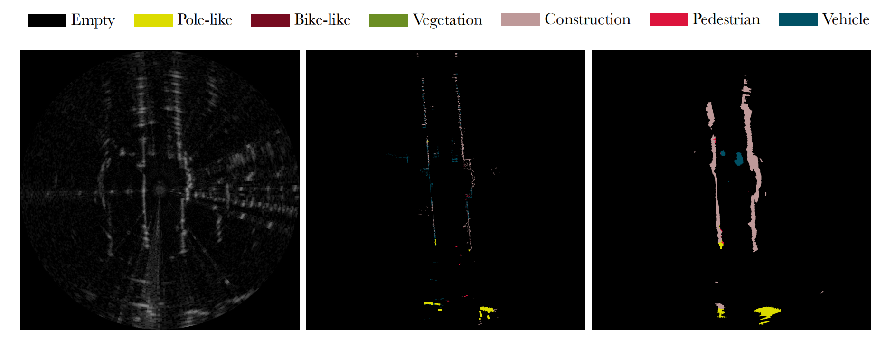
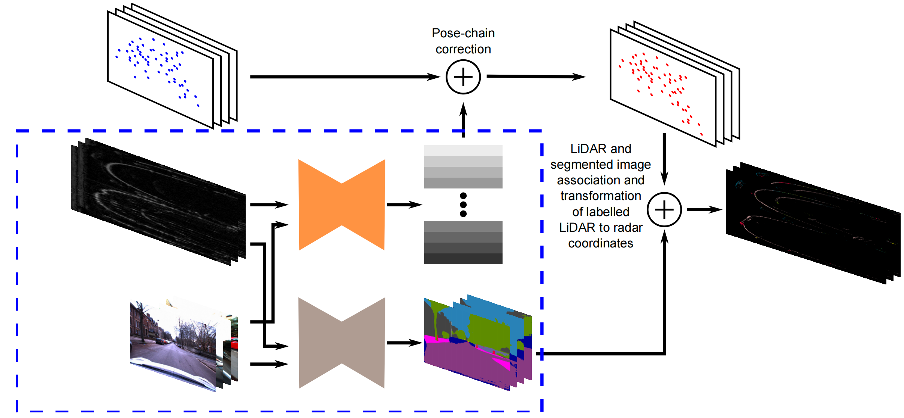
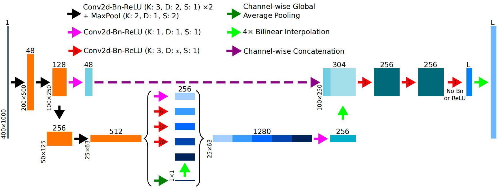
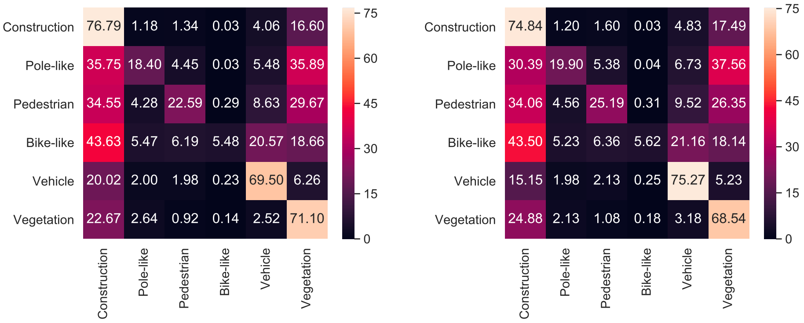

<div align="center">

# **RSS-Net：基于 FMCW 雷达的弱监督多类别语义分割**

#### RSS-Net: Weakly-Supervised Multi-Class Semantic Segmentation with FMCW Radar

</div>

---

于 IEEE 2020. 发表

---

## 📑 目录
- [目标](#目标)
- [骨架图](#骨架图)
- [雷达标签的生成](#雷达标签的生成)
- [RSS-Net](#RSS-Net)
- [类别权重](#类别权重)
- [实验与结果](#实验与结果)
- [写在后面](#写在后面)
  
---

## 目标

使用 FMCW 雷达做语义分割, 用弱监督实现大量但不精确的标签, 从而不用人工标注数据

依次是 原始雷达扫描图像, 用于训练网络的标注目标, 预测的语义分割结果

所有图像均采用笛卡尔坐标系表示, 此处笛卡尔表示形式: 分辨率为 $N×N = 1000×1000$ 的图像，其中$N$是原始极坐标表示中离散化距离回波的分区集合的基数



无清晰边缘, 反射斑点一堆, 建筑 / 车 / 人 长得很像. 那么如何不让人标雷达，但还能训练模型? -- 用相机(四个实现360°)和激光雷达(两个)生成标签

原因: 相机看不见的时候, 雷达还活着. 但雷达成像过程复杂(多路径反射/噪声多/虚假回波), 信息会被压缩(3D -> 2D), 导致不同物体在雷达视角中会非常像

注意: 作者在 RELATED WORK 中强调雷达标注的困难, 以此合理化他的弱监督方法

## 骨架图

其中蓝框内是离线准备好的了, 蓝色框外是训练时动态生成的



1. 相机的 RGB 图像给一个已经训练好的模型(Deeplabv3-DPC), 得到每个像素的语义类别

2. Pose-chain correction 用于把三个传感器的数据对齐到同一坐标, 同一时刻下

3. 训练时, 选一帧雷达扫描, 然后找到时间上最近的四张相机图和激光雷达点云, 用 Pose-chain 对齐它们

4. 把激光雷达的点投影到相机图像上, 通过像素的语义给激光雷达点云上标签

5. 把激光雷达坐标变化到雷达坐标, 3D 点投到 2D 雷达平面, 得到一张雷达的语义标签图. 对比上一张图片, 即使雷达语义标签(中间)非常的稀疏, 但模型预测的结果(右边)还是合理, 连贯的

## 雷达标签的生成

### 相机语义分割

作者使用的模型: DeepLabv3-DPC, 数据集: Cityscapes

数据集是前视相机, 白天, 干净画面. 本文是前/后/左/右四个视角, 广角, 模糊(车在运动)的画面. 虽然相机的分割结果并不完美, 但作者采样的弱监督, 不完美是可接受的

### 激光雷达和 RGB 融合

现相机知道了画面里是什么物体, 激光雷达知道这些物体在什么位置

将激光雷达扫描的每个 3D 点, 用参数标定, 投影到相机图像上, 查看像素的语义给 3D 点

### 激光雷达 <-> 雷达

用 LiDAR ↔ 雷达的外参把这些点变换到雷达坐标系, 并压到 2D 雷达平面, 再离散成像素网格, 得到雷达坐标系下的语义点. 如果多个点落在同一个像素，就随机选一个标签(作者说弱监督可接受)

### 同步

用车辆运动轨迹（pose chain）做时间插值(旋转用球面差值, 平移用匀速差值), 把所有数据都拉到雷达采样的那个时刻


### 标签累计

因为激光雷达的有效距离远小于雷达的

于是把前后时刻的激光雷达点都变换到当前雷达坐标下, 让标签可以捕获更远的范围

## 名词解释

FCNN: 没有全连接层的 CNN. 全连接层会固定输入尺寸, 去掉后输入多大输出多大, 即输入是图像，输出也是“图像”

Conv2d: 二维卷积. 提取雷达局部反射结构、纹理、强度模式

BN: 正则化. 让训练更稳定, 防止梯度炸 / 消失

ReLU: 激活函数. 让模型学习复杂模式

Max Pooling: 下采样的一种. 降低分辨率, 提高语义抽象, 但会丢细节

Bilinear Interpolation: 双线性插值. 上采样的一种, 把低分辨率语义拉大

Skip Connection: 把早期的高分辨率特征, 直接送到后面的解码器, 让边界更准, 小目标不丢

Dilated Convolution: 膨胀卷积. 在卷积核的元素之间插空

## RSS-Net

现在的雷达图是: 噪声大 + 标签稀疏 + 物体形状模糊的

L: 类别数量

Bn: 二维批量归一化

ReLU: 整流线性单元

K: 卷积核尺寸（所有卷积核均为正方形）

D: 膨胀/空洞长度

S: 卷积步长



- **输入(灰色)**

连续三帧(在通道维度堆叠)雷达扫描, 这样可以知道哪些物体是运动的

雷达图转换成 Cartesian, 每个像素 = 雷达反射强度, 图像空间大小: 400 × 1000, 通道数: 1

- **编码器(橙色)**

作用: 

逐步降低分辨率、提高语义抽象

细节:

使用扩张卷积(Dilated Convolution), 普通卷积感受野小, 网络只能看到局部亮点, 提取出来使 建筑 ≈ 一堆杂点, 墙 ≈ 噪声

作者只采样了四层池化, 防止下采样太多导致细节过早消失

操作:

400×1000×1 → 200×500×48

第一层编码从原始雷达亮度图提取低级结构特征, 如: 反射边缘, 局部条纹

200×500×48 → 100×250×128 → 50×125×256 → 25×63×512

第二层编码网络可以学习哪些局部结构是有意义的. 后两层编码进入高层语义特征, 如: 建筑整体, 长直墙面, 大体形状

- **ASPP(大括号内) - Atrous Spatial Pyramid Pooling**

作用:

整合编码结果, 让每个像素知道: 局部结构, 中距离上下文, 远距离结构, 全局环境

细节:

相机物体近大远小, 雷达随距离变化反射形态各异. ASPP 就是让网络知道: 不同尺度下，有些其实是同一类东西

作者在 ASPP 中加入了全局平均池化, 为了给网络一个全局场景先验. 如: 在街道上, 车更可能出现

操作:

25×63×512 → 25×63×1280(256 * 5)

用不同空洞率的卷积 + 全局平均池化, 1280 是五个分支拼接的结果

- **空洞/膨胀卷积 Dilated Convolution**

作用:

普通卷积只看附近, 空洞/膨胀卷积可以隔着看, 可以看的更远, 但不变模糊

ASPP = 同时看大 / 中 / 小尺度 + 全局语义

操作:

对应图中: dilation 6 → 看近, dilation 12 → 看中, dilation 18 → 看远, GAP → 看全局

- **压缩通道 +  上采样**

作用: 把深语义送回更高分辨率

操作:

25×63×1280 → 100×250×256

- **Skip Connection**

防止细节在处理中丢失, 把细节送回

把 Encoder 早期的特征(高分辨率) 和 ASPP 的语义特征拼接成 100×250×304(256 + 48)

这里是拼接, 残差是做加法, 怕网络学不会

- **解码器(右半部分)**

作用:

不进行语义理解, 而是把语义恢复到像素级

操作:

100×250×304 → 100×250×256 → 100×250×256 → 100×250×L

恢复分辨率, 卷积细化

- **输出**

作用:

训练时, 输出 L = 7 个通道, 用交叉熵做损失, 加==类别权重==

测试时, 对每个像素取 argmax, 得到一张语义雷达图

操作:

100×250×L → 400×1000×L

上采样(双线性插值)

## 类别权重
 
在雷达语义中, '空'的东西居多, 如果不进行处理, 网络会全部预测为 Empty, 作者使用对数权重:

$$
w[i] \propto \left( 1 + \log \frac{\sum_j t[j]}{N \cdot t[i]} \right)^2
$$

即: 类别越少 -> 权重越大, 增长是对数级别的, 不会爆炸. 而 Empty 权重稳定设置为 0.1, 毕竟空的占太多了, 很难压住权重

### 动态区分

'行人'和'杆状物体'在雷达中非常相似, 这是传感器导致的, 模型无法调优. 这也就体现出输入三帧的重要性, 将这三帧用 pose-chain 对齐, 静态物体就会重合, 动态物体就会位移, 而没有使用 RNN / LSTM, 依然是 FCNN

## 实验与结果

使用了 Oxford Radar RobotCar Dataset 的 GPS, 视觉里程计(VO), 回环检测(FAB-MAP). 对同一条城市路线, 划分了 Train, Validation, Test 三个数据集, 三者没有任何交集

训练阶段的数据增强: 作者只在水平,垂直轴上 50% 概率翻转. 没有加噪声等, 随便加噪声，可能不符合真实雷达成像

语义分割类: Empty, Construction, Pole-like, Pedestrian, Vehicle, Bike-like, Vegetation 七类. 由于雷达分不清"墙 - 栅栏","路灯 - 指示牌","草地 - 路面", 相机可以通过外观分清, 但雷达看上去都一样, 所以作者做了 类别合并 并 删除不可预测的类别

### 混淆矩阵

前一个是雷达完整的感知范围, 后一个是是雷达部分的感知范围(只评估近距离), 作者以此来网络学到了结构模式, 而不是某个距离外观 - 证明尺度等变性



<div align="center">

横轴: 真值; 纵轴: 预测值; 格子: 相似度

</div> 

从矩阵可以看出:

行人和杆子容易混: 雷达视角就是容易混

Bike-like 结果差: 由于自行车的摆放多数是靠在墙或成排摆放, 网络会把自行车当作噪声或建筑的一部分

作者说: 很多预测错的地方, 其实是标签本身错误 ??? 

相机标签是其他模型做的, 激光雷达标签是投影投的, 多个点重合投影还随机选一个标签, 雷达标签真值是激光转换的

## 写在后面

本文发布时间较早, 实验环境过于理想, 直接搬效果定然不理想, 但其中网络的结构设计可以参考学习

以下是一些概念解释

__Dilated Convolution: 在卷积核的元素之间插空__
```
■ ■ ■   1 1 1
■ ■ ■   1 1 1
■ ■ ■   1 1 1

■ · ■ · ■   1 × 1 × 1
· · · · ·   × × × × ×
■ · ■ · ■   1 × 1 × 1
· · · · ·   × × × × ×
■ · ■ · ■   1 × 1 × 1
```
卷积核都是 3×3, 前一个是普通卷积核(D=1), 后一个是膨胀卷积核(D=2). 但第二个的卷积核覆盖范围变成了 5×5, '×' 代表跳过该位置, 所以不是赋为 0, 理解成把图片放大后, 做卷积, 这样扩大感受野, 不增加参数数量, 不进行下采样

下采样: 用更少的点来表示一张图

上采样: 在已有信息之间, 做合理的估计(插值). 插入的点来自邻居的加权平均

**Bilinear Interpolation: 双线性插值**
```
Q11 ---- Q21
 |   p    |
 |        |
Q12 ---- Q22
```
估计中间某个点 p 的值

先在 $X$ 方向上, $x, y$ 是加权比例系数, 正如上采样中所说的加权平均

$$
R1 = (1 - x)\cdot Q11 + x \cdot Q21
$$

$$
R2 = (1 - x)\cdot Q12 + x \cdot Q22
$$

然后 $Y$ 方向上

$$
P = (1 - y)\cdot R1 + y \cdot R2
$$

当然先 $Y$ 后 $X$ 也行. 少用Transposed Convolution(反卷积)

**ResNet 残差网络**

在残差之前, 当网络变深, 训练集上的误差反而可能变大, 即网络退化. 残差的思想是: 不要让网络从零开始学习一个复杂函数

普通网络学习: 输入一个 $x$, 输出 $H(x)$, 即 $H(x) = x$

残差学习: $F(x) = H(x) - x$, 于是 $H(x) = y = F(x) + x$

在反向传播中, 梯度需要往回传很多层, 容易消失或不稳定, 而残差的 $y$ 中就有 $x$, 这样求导/梯度时, 再不济也是 1, 梯度不会消失