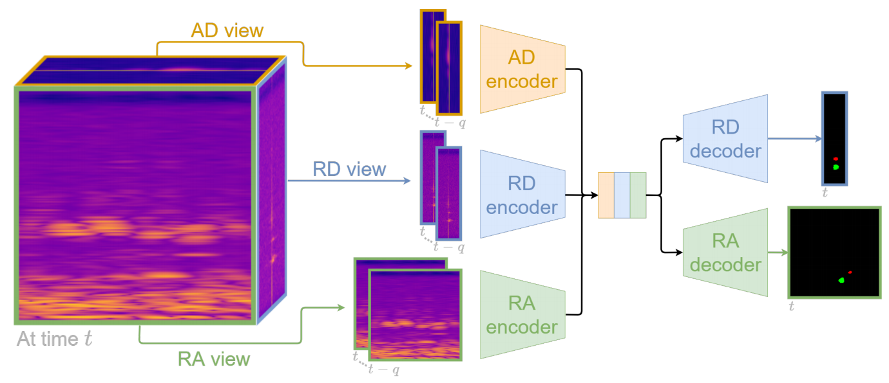
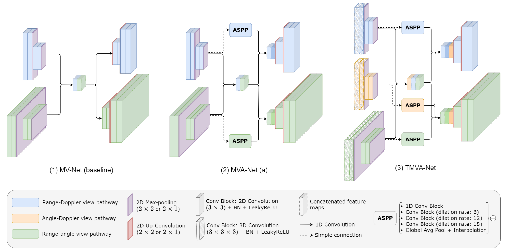
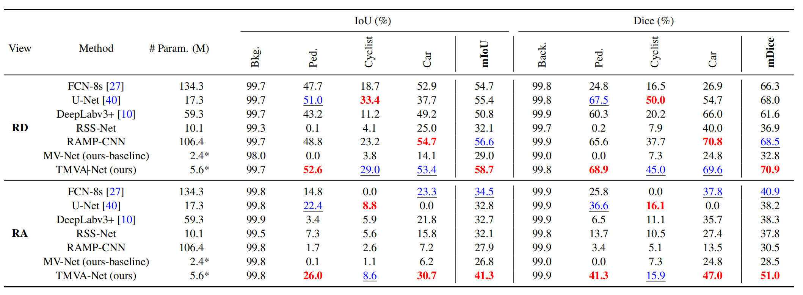
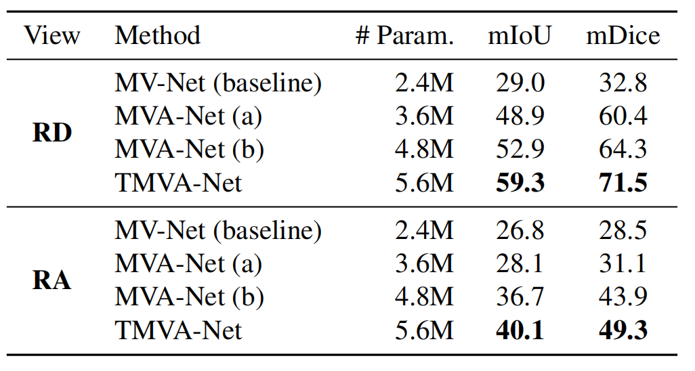
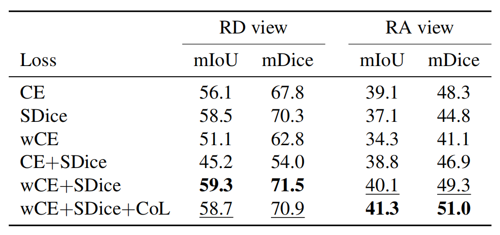

# **多视角雷达语义分割**

#### Multi-View Radar Semantic Segmentation

---

// 于 IEEE 2021. 发表

---

## 📑 目录
- [目标](#目标)
- [RAD张量](#RAD张量)
- [网络模型](#网络模型)
- [本文网络](#本文网络)
- [损失函数](#损失函数)
- [实验结果](#实验结果)
- [写在后面](#写在后面)
  
---

## 目标

用深度学习, 实现多视角下的雷达语义分割. 本文所谓多视角, 是一个扫描后的不同的数据形式, 本文将 RAD 三维张量压缩成多个二维视图, 重点使用 RA(距离-角度), RD(距离-速度). RAD 张量太大, 噪声多, 很难直接使用

随着公开雷达数据集(如 CARRADA)的增多, 模型的学习效果更好了

## RAD张量

通过 Range FFT, Doppler FFT, Angle FFT 处理原始 ADC 信号, 得到距离–角度–多普勒(RAD)张量[256 × 256 × 64]

然而: 

实时计算 RAD 太慢了, 工程实现中经常做 CFAR(阈值检测)和点云, 但 RAD 张量中信号强度(复数模的平方)包含了物体反射能量的信息

由于相干成像, 后向散射信号呈现出强烈的波动现象, 即斑点效应. 即雷达图像不是平滑的, 像老电视机的雪花点. 对于噪声的干扰, 采用平均(减噪) + 取对数(数值更稳)的做法

RA (速度维度压掉，只看距离 + 角度)的压缩公式:

$$
x^{RA}[r,a]
= 10 \log_{10}\!\left(
\frac{1}{N_D}
\sum_{d}
\left| X^{RAD}[r,a,d] \right|^2
\right)
$$

$N_D$ 表示多普勒频段数

RD, AD 进行相同操作, 转成二维不仅可以降低数据规模, 还能降低噪声

1. RA 视图: 对 Doppler(速度)维度求平均得到, 可以知道物体在前方多少米, 是偏右多少度还是偏左多少度

2. RD 视图: 对 Angle(角度)维度求平均得到, 可以知道物体是朝我来, 离我去, 还是静止不动. 这个最为有用, 它在每个距离单元上都指示了场景反射体的相对速度

3. AD 视图: 对 Range(距离)维度求平均得到, 它看的是左右方向和动态模式, 不做最终输出,而是辅助理解

## 网络模型

作者对比了 RSS-Net(上一周读的文章)中的动静态物体分割方法, 当然作者还对比了其他网络, 但除了 RSS-Net, 其他网络都不是针对雷达语义分割设计的, 所以不具备处理多视角数据的能力

RSS-Net: 只做 RA, 只输出一个视图, 不关心速度. 在距离–角度鸟瞰图(BEV)语义分割任务中取得了优秀性能

FCN(全卷积网络): 输入一张图, 每个像素都输出一个类别. CNN 对于一张图只会输出一个类别结果. FCN 已被用于雷达数据的语义分割任务中, 其中 FCN-8s 版本取得了最佳性能

U-Net: 把早期的细节直接送到后期的重建, 最初用于医学图像(与雷达图像结构很像), 尤其适合进行小目标的语义分割

DeepLabv3+: 在自然图像语义分割领域的编码器–解码器模型, 擅长多尺度, 关键在于膨胀卷积和 ASPP 模块

RAMP-CNN: 雷达多视角神经网络，用于在 RA 表示中进行目标检测, 没有做分割. 该网络也将 RAD 压缩了多个 2D 视图, 每个视图用一个网络处理, 用 3D 卷积 处理时间 + 空间, 在距离–角度视图中对多个目标进行定位和分类方面达到了当时的最优性能

## 本文网络

有三个轻量级(编码器和解码器之间不共享权重)神经网络, 这些网络以多帧雷达视图作为输入，并通过各自独立的编码器进行处理, 生成的特征图会被融合到一个空间中，并由不同的解码器分别预测各个输出视图的语义分割结果

### MV-Net

基础模型, 只有多视角 + 轻量化, 形式为双编码器–解码器结构，用于处理堆叠的 RD 和 RA 视图，并同时预测 RD 和 RA 的语义分割结果

- 编码器由两个模块组成, 每个模块包含两组 [卷积 + 批量归一化 + 激活] 组成

- 下采样使用的是最大池化, 且只在距离维度上进行下采样. 因为速度分辨率本身就低, 再下采样就消失了

- 下采样后将两个编码器的特征图分别一维卷积后, 拼接起来. 输入的视图是按时间维度堆叠的

- 两个解码器分别预测 RD 和 RA 的语义分割结果特征, 先通过一维卷积生成 K 个特征图, k 是类别数量. 然后在 k 个特征图上进行 softmax 激活, 得到每个像素点的类别概率(软分割掩码)

### MVA-Net

在 MV-Net 基础上加入了多尺度理解, 引入 ASPP 模块, 该模块可以在同一张特征图上, 实现不同间距的看, 而无需使用更大的卷积核或显著增加参数量

- 在每个编码器和解码器之间添加 ASPP 分支, ASPP 生成的多尺度特征图会被拼接起来，经由一维卷积处理后，作为输入堆叠到对应的解码器中, 这个在图中画出 MVA-Net(a)

作者在上述 MVA-Net 中又做了一次改进, 增加了一条额外分支, 用于从 AD 视图中学习特征, 处理和另外两个一样, 称 MVA-Net(b), 因为 AD 包含了角度和速度信息, 所以 AD 分支生成的多尺度特征图(ASPP模块)会同时送入两个解码器中, 如此 RA 不仅有角度信息还有速度信息, RD 同理,可以类比 TMVA-Net

### TMVA-Net

在 MVA-Net(b) 加入时间维度, 即使在高噪声水平下, 时间信息也有助于估计目标特征的形状, 并区分那些彼此接近、速度相似的目标. 可以理解成噪声随着时间变化, 而真实物体的结构是非常稳定的, 那么时间维度可以一定程度分离噪声

- 在每个编码分支中, 第一个模块的二维卷积(宽×高)替换成三维卷积(空间 + 时间), 三维卷积参数量大, 所以只替换第一层

TMVA-Net 有 时间 + 多视角 + 多尺度 + 轻量化 特点

## 损失函数

网络结构决定能不能学, 而损失函数决定学成什么样

作者时时刻刻都在提单/多视角的区别, 此处不再赘述了, 只写明作者使用了什么 Loss

$f_θ(x)=p$: 一个语义分割模型
$f_θ$: 神经网络
$x$: 输入
$y$: 真值
$p$: 预测值

### Weighted Cross Entropy

和 RSS-Net 中一致, 使用加权交叉熵, 因为雷达图里大多都是噪声和背景, 普通交叉熵会把真实物体的像素忽略, 导致预测出的都是背景, 权重分配也是和 RSS-Net 中一致

$$
\mathcal{L}_{\mathrm{wCE}}(y,p)
= -\frac{1}{K}
\sum_{k=1}^{K} w_k
\sum_{(m,n)\in\Omega}
y[m,n,k]\,
\log p[m,n,k]
$$

### Soft Dice Loss

针对小目标的损失函数, 如医学图像和雷达图像

$$
\mathcal{L}_{\mathrm{SDice}}
= \frac{1}{K}
\sum_{k=1}^{K}
\left(
1 -
\frac{
2 \sum y \cdot p
}{
\sum y^2 + \sum p^2
}
\right)
$$

### Coherence Loss

作者希望检测的目标在不同雷达视图中都会被观测到，因此需要在这些视图的预测之间保持一定的一致性, 该损失函数可以实现跨视角一致性. 也是核心创新

1. 对于两个视图的预测结果, 在不共享的轴上用 max 运算进行聚合(RA, RD 共享距离 R)
2. 一致性损失定义为这两个最大距离概率向量之间的均方误差(MSE), 即 RA 和 RD 在“同一个距离”上, 对“同一个类别”应该有相近的置信度

### 训练目标

最终的损失函数是三者的加权和: RD + RA 的加权交叉熵, RD + RA 的 Soft Dice, RD 与 RA 之间的一致性损失

$$
\mathcal{L}
=\lambda_{\mathrm{wCE}}
\left(
\mathcal{L}_{\mathrm{wCE}}^{RD}
+
\mathcal{L}_{\mathrm{wCE}}^{RA}
\right)
+
\lambda_{\mathrm{SDice}}
\left(
\mathcal{L}_{\mathrm{SDice}}^{RD}
+
\mathcal{L}_{\mathrm{SDice}}^{RA}
\right)
+
\lambda_{\mathrm{CoL}} \,
\mathcal{L}_{\mathrm{CoL}}
$$

## 实验评估

使用 CARRADA 数据集: 公开提供 RAD 张量，并对 RD 和 RA 视图都给出稠密语义分割标注的数据集, 雷达视图的标注是通过半自动流程完成

共四个类别: 行人、自行车、汽车和背景, 分为训练集、验证集和测试集

此外使用了自行采集的, 更复杂的城市场景, 来验证模型的泛化能力, 用以下指标进行评估

### 评估标准

交并比(IOU): 对于某一类别, IoU 定义为预测区域与真实区域的交集面积除以并集面积. 本文取所有类别的平均 IOU

Dice(F1 分数): 预测与真实区域交集的两倍除以二者面积之和, 等价于精确率与召回率的调和平均(即 F1 分数)

两个指标互补, 自行采集的数据是无标注的, 因此无法定量评估

### 细节评估

此外, 作者进行了实现细节评估, 分别和只对 RD 分割(RAMP-CNN)和只对 RA 分割(RSS-Net)的单视角模型进行对比 [对原网络修改, 以适配作者的数据]

作者还对一些图像处理网络进行了比对

# 结果

实验在 PyTorch 框架下, 使用 RTX 2080Ti, 在 mIoU / mDice / 参数量层面进行了比对, TMVA-Net 取得了最佳平衡, 且这一个模型同时对两个视图分割

模型消融实验

损失函数消融

再次说明, Coherence Loss 可以有效防止多个视角差异化

总计: 将多尺度特征提取、时间信息以及一致性损失相结合, 可以显著提升分割性能

TMVA-Net: 时间 + 多视角 + 多尺度 + 轻量化 特点

未来: 提升对骑自行车的人与行人等类型的分割精度，因为只有雷达, 有些物体仍难以区分. 可以利用雷达特性或改进 RAD 张量聚合技术及特定类别数据增强方法, 以及融合其他传感器数据

## 写在后面

作者没有用点云, 于是抨击了点云方法. 作者用的是多视角, 于是还抨击了单视角方法, 抨击是优缺点都说, 但缺点多. 多视角方法也有研究, 但像本文这样的, 是第一个

看上去很难在 TMVA-Net 上进行优化, ADC 原始信号的处理结果也就这么多, 从方法的完整性考虑, 已经到头了

1. 引入 Transformer (在此文章后才出现的)

2. 直接对 RAD / ADC 做学习

3. 针对雷达图像的特点, 正对性设计卷积计算方式

4. 对 4D 雷达数据处理