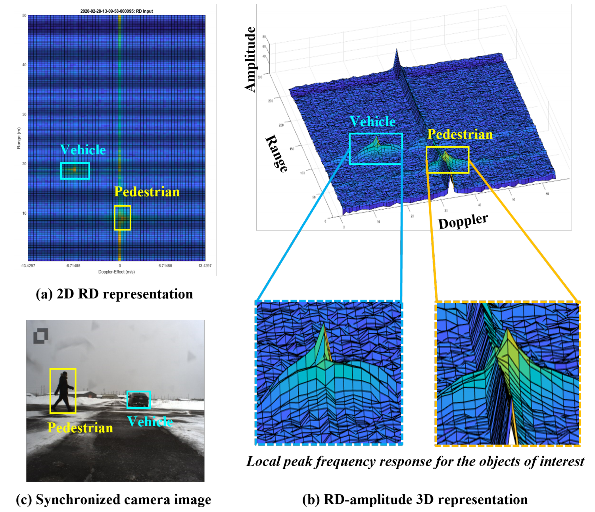
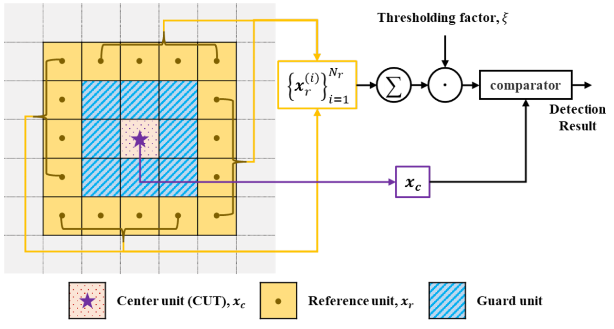
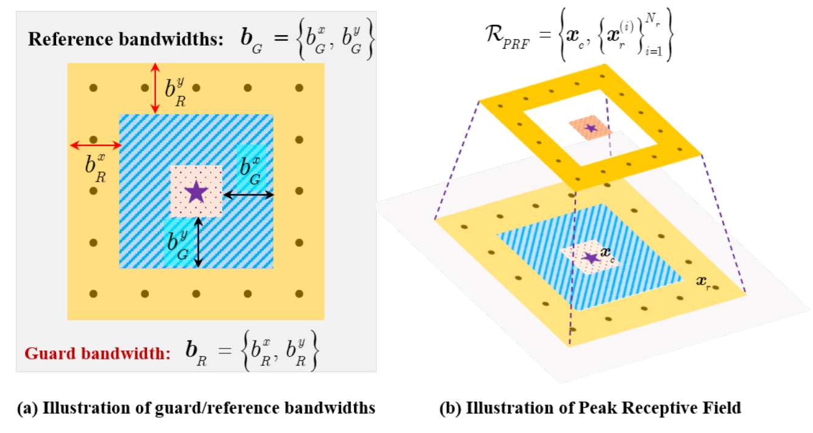
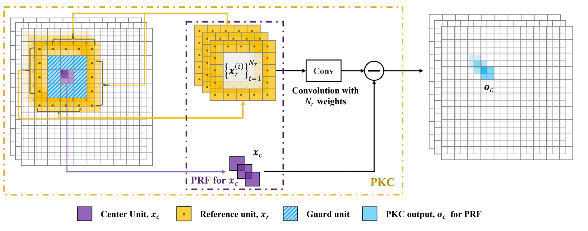
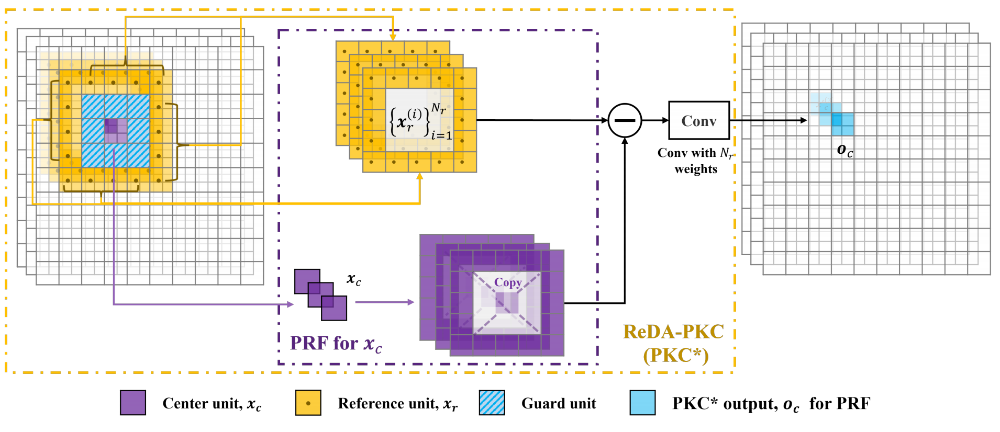
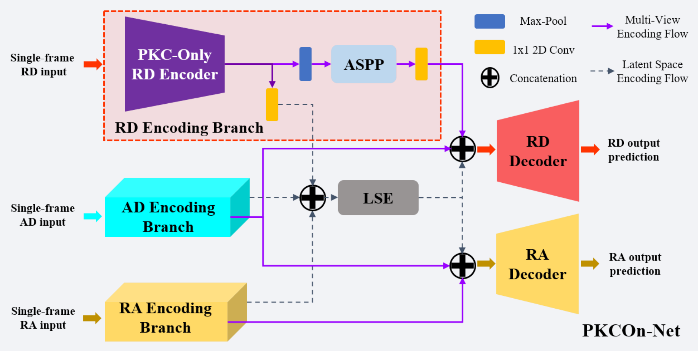

<div align="center">

# **PeakConv：一种面向雷达语义分割的峰值感受野卷积方法**

#### PeakConv: Learning Peak Receptive Field for Radar Semantic Segmentation

</div>

---

于 IEEE Xplore 2023. 发表

---

## 📑 目录
- [目标](#目标)
- [传统做法](#传统做法)
- [本文做法](#本文做法)
- [使用](#使用)
- [实验结果](#实验结果)
- [写在后面](#写在后面)
  
---

## 目标

寻找了一种专门给雷达用的卷积(PeakConv)，让神经网络更容易找到雷达里的目标峰值，从而提升雷达语义分割效果

雷达语义分割（RSS）：给**雷达频谱图里的每一个格子(cell)**打标签, 而无论哪种频谱图(RD、RA、AD), 本质都是二维能量图, 目标在雷达中不是具体形状, 而是局部的一个能量峰值(peak). 卷积的表现很大程度取决于感受野怎么选, 而现有的卷积算法都是为图像所设计的, 默认为形状 + 纹理, 可以做雷达, 但不够贴合



## 传统做法

CFAR: 对每一个格子进行检测, 划分为三层结构: 参考区、保护区、要判断的点

1. 先计算参考区看看背景平均能量(计算噪声)

2. 对背景强度乘一个系数, 计算出一个动态阈值

3. 比较中心点的能量, 如果高于阈值判断为目标峰值, 否则是背景



外圈R：参考单元（reference cells）  ← 用来估计背景

中圈G：保护单元（guard cells）      ← 故意不用

中心C：CUT（要判断的点）

```
R R R R R
R G G G R
R G C G R
R G G G R
R R R R R   
```

如果中心点真的是目标点, 那么紧挨着该点的其他点的能量也会很高, 如果用这些点去估计背景, 阈值就会被抬高, 模型反而检测不到目标, 所以使用保护区隔离离目标太近的点

那么图像卷积就用到了保护区, 可能会把目标能量和背景能量混在一起算

## 本文做法

Peak Receptive Field(PRF): 卷积之前，先决定哪些点是可以用来当背景的. 结构和 CFAR 一样: 保护区, 参考区, 中心点

中心点 $x_c$

保护区宽度 $b_G$

参考区宽度 $b_R$

参考点集 $x_r$

参考点和中心点在雷达图中的位置 $p_r^{(i)}, p_c$

$$
\begin{aligned}
\mathcal{R}_{\mathrm{PRF}}
&=
\{\, x_c,\; \{x_r^{(i)}\}_{i=1}^{N_r} \,\}, 
&\text{s.t.}\;
|b_G|
<
|p_r^{(i)} - p_c|
\le
|b_R + b_G|.
\end{aligned}
$$

约束限制了参考点不能在保护区内, 也不能超过最大参考范围

计算参考点总数量:

$$
N_r
=\prod_{z \in \{x,y\}}
\left[
2 \left( b_G^{z} + b_R^{z} \right) + 1
\right]
-\prod_{z \in \{x,y\}}
\left(
2 b_G^{z} + 1
\right)
$$



普通卷积, 对每个中心点: 输出 = Σ(周围点 × 各自权重), 学习的是局部模式长什么样

### Vanilla-PKC

1. 取 PRF

2. 用参考点估计背景/干扰/噪声, 没有用到中心点, 只计算: 如果这里只有背景, 那么有多强的能量

3. 输出 = 中心点 − Σ(参考点 × 各自权重). 输出大, 中心点就像目标; 输出小, 中心点就像噪声

$$
\mathrm{PKC}(\mathcal{R}; W)=
x_c-
\mathrm{Vec}
\!\left(
\{\, 
\sum_{i=1}^{N_r}
w_j^{(i)} * x_r^{(i)}
\,\}_{j=1}^{C_{\text{out}}}
\right)
$$

$Vec$ 做向量化, 把多个通道拼成输出特征



Vanilla-PKC: 最基础的 PeakConv, 几乎完全模仿 CFAR, 除了:

| CFAR   | Vanilla-PKC |
| ------ | ----------- |
| 手工平均   | 可学习加权       |
| 固定阈值系数 | 网络自动学       |
| 单一功能   | 可嵌入深度网络     |

现实雷达里有弱噪声(电子噪声), 有强杂波(不感兴趣的物体), 而 Vanilla-PKC 对所有干扰都平等对待; 且背景估计不考虑中心点, 对于不同的目标, 抑制方式不够灵活

### ReDA-PKC

不先估计背景, 而是直接算差异 = $x_c − x_r$, 对算出的差异做加权求和

输出: Σ((中心点 - 参考点) × 各自权重). 可以区分中心点和周围每一个点的差异有多明显

$$
\mathrm{PKC}^{\star}(\mathcal{R}; W)=
\mathrm{Vec}
\!\left(
\{\, 
\sum_{i=1}^{N_r}
w_j^{(i)} * \bigl( x_c - x_r^{(i)} \bigr)
\,\}_{j=1}^{C_{\text{out}}}
\right)
$$

不同干扰的差异不同, ReDA-PKC 网络能学到, 哪些差异值得抑制，哪些值得保留



| 维度      | 普通卷积 | PeakConv   |
| ------- | ---- | ---------- |
| 出发点     | 图像视觉 | 雷达检测（CFAR） |
| 目标假设    | 连续形状 | 局部峰值       |
| 感受野     | 实心矩形 | 中空 PRF     |
| 中心点角色   | 普通 | 主角       |
| 是否区分背景  | 否  | 是        |
| 是否显式算差异 | 否  | 是        |
| 对峰值的影响  | 稀释   | 强化         |

文中没有明确指出损失函数, 一般使用标准损失函数, 雷达语义分割(RSS)是一个标准的多分类语义分割问题, 一般使用多类交叉熵损失(Categorical Cross Entropy)

$$
\mathcal{L}_{\mathrm{CE}}(x)
=-\sum_{c=1}^{C}
y_c \log(\hat{y}_c)
$$

$$
\mathcal{L}
=\frac{1}{N}
\sum_{i=1}^{N}
\mathcal{L}_{\mathrm{CE}}(x_i)
$$

$C$ 是类别数

## 使用


输入是雷达多视角频谱图(RD、RA、AD), 在关键位置插入 PeakConv

每个输入都先过一个 3D 卷积基础编码器, 提取初级雷达特征和时间变化信息

然后是 Vanilla-PKC / ReDA-PKC , 让网络在中高层特征图上, 显式计算峰值响应(判断背景与中心)

LSE 融合三个视角的特征

最后是解码器, 输出分割后的类别概率



本网络比上一个更激进一点, 把前面的 3D 卷积也换掉了. 在后续试验中验证结果是可以的, 并且单帧在区分目标与背景/杂波的能力就很强

说明本算子既可以插入, 也可以单独使用

## 实验结果

通过设置保护区宽度的大小, 证明保护区的实际价值 [表1]

通过对比卷积算子: 普通 Conv, Dilated Conv, Deformable Conv, PeakConv / ReDA-PKC. 网络框架、输入帧数、损失函数都相同, 证明 PeakConv 的优势，不来自参数多，
而来自它在算对的东西 [表2]

此外作者还和主流的 RSS 算法(SoTA)做对比, 在同一数据集、同一你指标下 [表3]

表见文章, 此处不展示了

## 写在后面

对于保护区宽度、参考区宽度都是人为设定, 不适合所有目标, 需要其自适应学习

数据集来自 CARRADA, 虽然对一部分标注做了再校准(原始 CARRADA 的 RA 视角标注存在偏差, 所以进行了 RAC 标注校正), 但没有验证泛化性

损失函数没有尝试研究, 只用了主流损失

本文只是在卷积算子上做了改进, 复用也不复杂